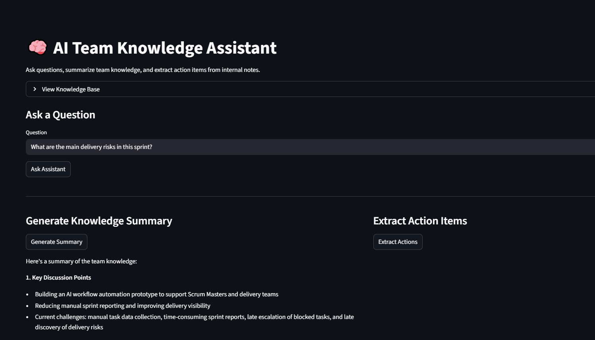
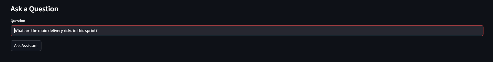

# 🧠 AI Team Knowledge Assistant

An AI-powered assistant that helps teams query internal knowledge, generate summaries, and extract action items from meeting notes and documentation.

This project simulates how modern teams can use LLMs to reduce manual reading, improve knowledge access, and automate follow-ups.

---

## 🚀 Features

- 🧠 Ask questions from team knowledge base
- 📄 Generate structured summaries (decisions, risks, actions)
- ✅ Extract action items with ownership
- 📥 Download AI-generated reports (JSON)
- 📚 Context-aware responses (no hallucination design)

---

## 🛠️ Tech Stack

- Python
- Streamlit
- Groq API (LLM)
- dotenv

---

## 📸 Screenshots

### Main Interface


### Ask Questions


### Summary & Actions


---

## ⚙️ How to Run Locally

### 1. Clone the repository

```bash
git clone https://github.com/Talhabyte/ai-team-knowledge-assistant.git
cd ai-team-knowledge-assistant
